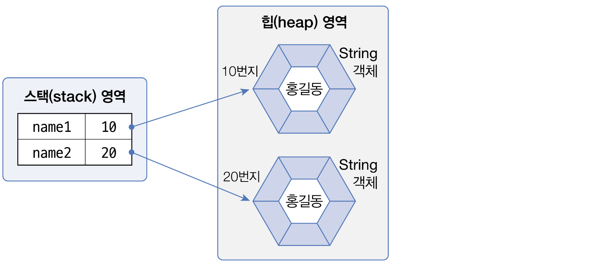
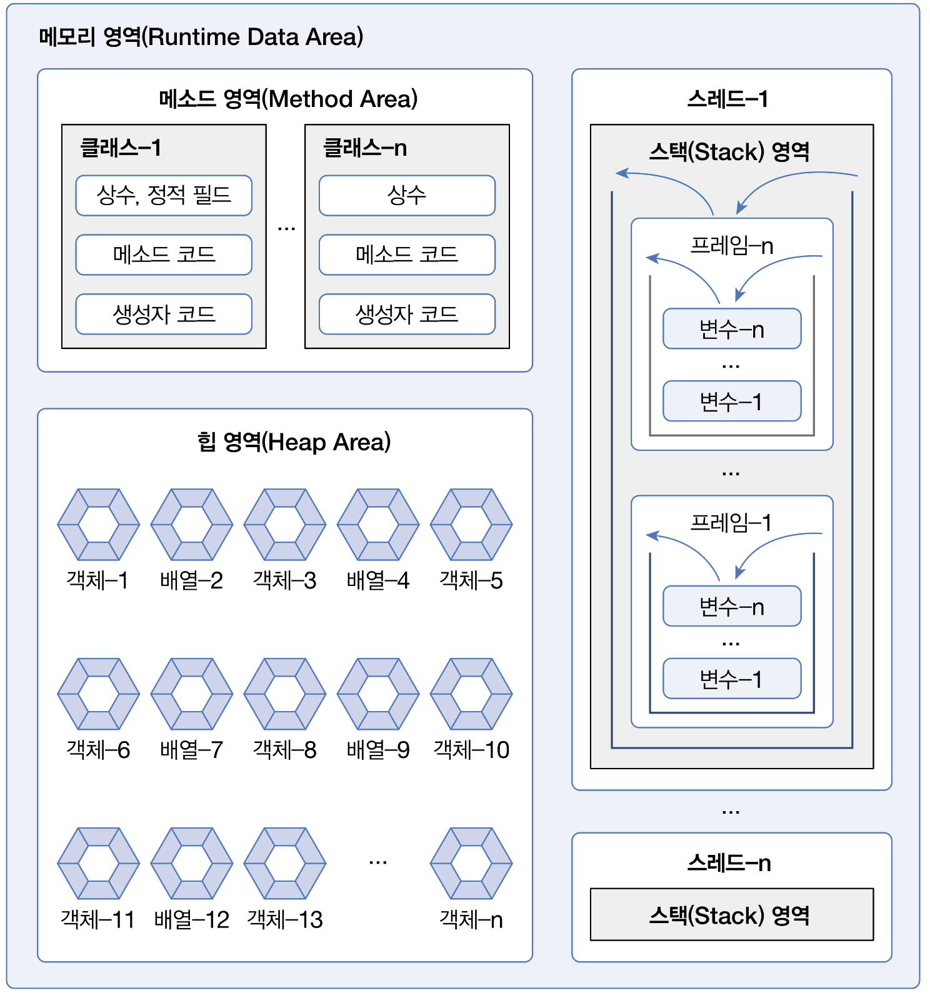

# Chapter 5 - 참조 타입

## 5.1. 데이터 타입

데이터 타입은 기본 타입과 참조 타입으로 나뉜다.
  + 기본 타입 (primitive type)
    - 정수 타입
    - 실수 타입
    - 논리 타입

  + 참조 타입 (reference type)
    - 배열 타입
    - 열거 타입
    - 클래스
    - 인터페이스

기본 타입과 참조 타입의 차이는 저장되는 값이다.

- 기본 타입 -> 값 자체를 저장
- 참조 타입 -> 객체가 생성된 메모리 번지를 저장



변수들은 모두 스택이라는 메모리 영역에 저장되고, 참조 타입의 경우 힙 메모리 영역의 String 객체 번지를 저장하고 있으며 이를 참조하고 있는 구조다.

## 5.2. 메모리 사용 영역


#### 1. 메소드 영역

- 바이트코드 파일을 읽은 내용이 저장되는 영역
- 클래스 별로 상수, 정적 필드, 메소드 코드, 생성자 코드 등이 저장됨

#### 2. 힙 영역

- 객체가 생성되는 영역

#### 3. 스택 영역

- 메소드를 호출할 때 마다 생성되는 프레임이 저장되는 영역
- 메소드 종료 후 해당 프레임들은 제거됨
- 프레임 내부에 로컬 변수 스택이 있는데 여기에 기본 타입 변수와 참조 타입 변수가 생성됨

#### 4. 추가 정보) JVM의 메모리 관리 방식

힙 영역에서 참조하는 않는 객체는 JVM의 GC에 의해 관리되어진다. 메소드 영역은 Class Loader가 언로드될 시점에 메모리에 로딩된 클래스들의 메타데이터들을 메모리에서 제거하며 스택 영역은 메소드 실행 시 생성되는 프레임 단위로 관리되며 메소드의 실행이 종료되면 JVM이 직접 해당 프레임을 제거한다.

## 5.3. 참조 타입 변수의 ==, != 연산

앞선 설명에서 참조 타입의 경우 기본 타입과 다르게 객체가 생성된 메모리의 번지를 저장한다고 했다.

```java
arr1 = new int[] {1, 2, 3, 4};
arr2 = new int[] {1, 2, 3, 4};
arr3 = arr2;

System.out.println(arr1 == arr2);
System.out.println(arr2 == arr3);
```

이러한 코드가 있을 때 arr1과 arr2는 서로 다른 객체이므로 서로 다은 메모리 주소 값을 가질 것이다. 그리고 arr2와 arr3은 같은 객체이므로 같은 메모리 주소를 참조하고 있다.

따라서 해당 코드를 실행해보면 false, true 순서로 나오는 것을 확인할 수 있다.

## 5.4. null과 NullPointException

참조 타입 변수는 null 값을 가질 수 있다.

```java
int[] arr = null;
arr[0] = 10;
```

만약 이러한 코드가 있다면 `NullPointerException`이 발생할 것이다. arr이 참조하는 배열 객체가 없는 상태이므로 10을 저장할 수 없기 때문이다.

```java
String str = null;
System.out.println("총 문자열 수 : " + str.length())
```

다음 코드도 실행 시켜보면 `NullPointerException` 이 발생할 것이다. str 변수가 참조하는 String 객체가 없으므로 문자열의 길이를 구할 수 없기에 에러가 발생하는 것이다.

만약 어떠한 참조 변수에도 객체를 참조하고 있지 않으면 해당 객체는 더 이상 프로그램에서 사용할 수 없는 쓰레기 객체가 된다. 

힙 메모리에는 존재하지만 위치를 더 이상 알지 못하기에 자바는 이러한 객체를 쓰레기 객체로 판단하고, GC를 실행시켜 자동으로 제거하게 된다.
