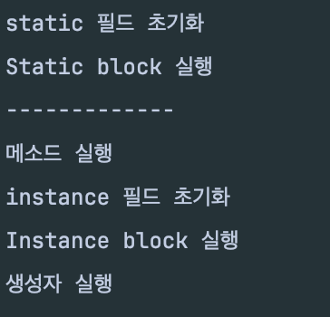

# Chapter 6 - 클래스

## 6.1. 객체 지향 프로그래밍

- 객체들 간의 상호작용을 통해서 문제를 해결하는 프로그래밍 기법

#### 객체
- 현실 세계의 사물이나 개념을 프로그램 안에서 표현한 것
- 데이터(속성, 필드)와 행동(기능, 메소드)을 하나로 묶은 독립적인 단위

### 특징

#### 1. 추상화

> 불필요한 세부 사항은 숨기고, 핵심적인 특징만 모델링 하는 것

- 현실의 복잡한 개념을 코드로 단순화하는 과정

```java
class Car {
	void drive() {...} // 주행 가능만 표현
}

```

#### 2. 캡슐화

> 필드와 메서드를 하나로 묶고, 외부 접근을 제한하는 것

- 외부에서 객체 내부 데이터를 직접 바꾸지 못하게 막음
- `private`, `public`, `protect` 를 통해 제어

```java
class Account {
	private int balance;
	
	public void deposit(int amount) {
		balance += amount;
    }
	
	public int getBalance() {
		return balance;
    }
}
```

#### 3. 상속

> 부모 클래스의 필드와 메소드들을 자식 클래스가 물려받는 것

- 코드의 중복을 줄이고, 공통 로직 재사용 가능

```java
class Vehicle {
    void move() { System.out.println("이동 중..."); }
}

class Car extends Vehicle {
    void horn() { System.out.println("빵빵!"); }
}
```

#### 4. 다형성

> 같은 메서드 이름이 객체에 따라 다르게 동작하는 것

```java
class Animal {
    void sound() { System.out.println("동물이 소리냄"); }
}

class Dog extends Animal {
    void sound() { System.out.println("멍멍!"); }
}

class Cat extends Animal {
    void sound() { System.out.println("야옹~"); }
}
```

## 📌 필드 vs 로컬 변수

#### 로컬 변수

- 생성자와 메소드 블록에서 선언
- 생성자, 메소드 호출시에만 존재
- 생성자, 메소드 블록 내부에서만 사용

#### 필드

- 클래스 블록에서 선언
- 객체 내부에 존재
- 객체 내,외부 어디든 사용

## 6.7. 생성자 선언과 호출

### 1. 생성자 오버로딩

- 오버로딩: 매개 변수를 달리하는 같은 이름의 메소드를 여러 개 선언하는 것
- 생성자 오버로딩: 매개 변수를 달리하는 생성자를 여러 개 선언하는 것

```java
public class Calculator {
    public int add(int a, int b) { return a + b; }
    public double add(double a, double b) { return a + b; }
    public int add(int a, int b, int c) { return a + b + c; }
}
```

#### 🔍 컴파일 타임에 결정

자바 컴파일러가 어떤 메소드를 호출해야 할지 코드 작성 시점에서 이미 결정해버리기 때문에 런타임 중에 어떤 인스턴지가 들어올지를 보고 결정하지 않고, 컴파일 시점에 결장나게 된다. (반면, 오버라이딩은 런타임 시점에 결정)

## 6.9. 인스턴스 멤버

- 객체에 속하며 객체 생성시 생성되고, 객체마다 존재
- 객체에 소속된 멤버로 일반적인 필드와 메소드가 여기에 해당

인스턴스 멤버는 객체에 '소속' 된 거지 '포함' 된거라고 볼 순 없다. 필드의 경우 객체에 소속된 멤버가 분명하지만 메소드의 경우 코드 덩어리 이므로 객체마다 저장한다면 메모리 효율이 매우 떨어질 것 이다. 그러므로 메소드 코드는 메소드 영역에 두어 공유해서 사용하되 객체 없이는 접근 할 수 없도록 제한을 걸어둔 것이다.

## 6.10. 정적 멤버

- 정적 멤버는 클래스 자체에 속하며 클래스가 처음 로딩될 때 딱 한번 생성됨
- 객체를 생성할 필요 없이 클래스 이름으로 바로 사용 가능
- `static` 키워드를 추가하면 됨

자바는 클래스 로더를 통해 클래스를 메소드 영역에 저장하고 사용하는데, 정적 멤버는 클래스 내에서 고정적으로 위치하는 멤버이다. 그러므로 객체 생성 없이 바로 사용이 가능한 것이다.

### 정적 블록

일반적으로 정적 필드는 필드 선언과 동시에 초기화한다. 하지만 정적 멤버에 복잡한 초기화 로직이 필요하다면 정적 블록을 사용해야한다.

```java
static {
    ...	
}
```

정적 필드는 클래스 로딩 시점에 메서드 영역에 올라가며, 이때 초기화도 이루어지게 된다. 하지만 생성자의 경우 인스턴스 생성 후 실행되기 때문에, 정적 필드를 생성자에서 초기화할 수 없는 것이다. 

`static` 블록은 클래스 로딩 후 초기화 시점에 실행되기 때문에 인스턴스 생성 후 초기화되는 **인스턴스 멤버에 접근할 수 없는 것이다.**

### 📍 추가 정보

#### 1. 클래스 초기화 순서 (static 필드, static 블록, 인스턴스 초기화 블록, 생성자)

해당 내용을 확인하기 위해서 `StaticTestExample.java` 코드를 실행해보면



다음 사진과 같은 출력 결과를 확인할 수 있다.

### 2. static 필드 초기화와 lazy loading의 관계

> 📌 Lazy Loading: 리소스, 클래스, 객체 등을 사용될 때까지 생성하지 않고 미뤄두는 전략 

static 초기화는 기본적으로 `Eager(즉시 초기화)` 이다.

```java
class Singleton {
    private Singleton() {}

    private static class Holder {
        static final Singleton INSTANCE = new Singleton();
    }

    public static Singleton getInstance() {
        return Holder.INSTANCE;
    }
}
```

- `Holder` 클래스는 `getInstance()` 가 호출될 때 까지 로딩되지 않음
- JVM의 클래스 로더가 런타임 시점에 해당 클래스를 로딩할 지 결정함

## 6.11 final 필드와 상수

`final` 은 '최종적' 이라는 의미를 가지고 있다. 자바에서 '최종적' 이라는 말의 의미는 초기값이 한번 저장되면 프로그램 실행 도중에 수정할 수 없게 된다는 말이다. 

또한 `final` 은 클래스, 메서드, 필드에 각각 붙일 수 있다.

#### 1. `final` 클래스는 상속할 수 없다.

```java
public final class Car { } // final 클래스는 상속할 수 없다!

public class Bus extends Car { }
```

`final` 클래스는 최종적인 클래스이므로 상속을 할 수 없다.

#### 2. `final` 메소드는 오버라이딩 할 수 없다.

```java
public class Animal {
    public final void bark() {
        System.out.println("짖다.");
    }
}

public class Dog extends Animal {
	
    @Override
    public void bark(){
        System.out.println("멍멍"); // ERROR!
    }
}
```

`final` 메소드는 최종적인 메소드이므로 오버라이딩을 통한 재정의도 불가능 하다.

### 상수

상수란 불변적인 값을 의미한다. 원주율 파이 나 지구의 둘레 등고 같은 값이 해당된다.

이러한 상수는 `static final` 을 통해 지정할 수 있다. 객체마다 저장할 필요가 없고, 여러개의 값을 가져도 안되므로 `static` 이면서 `final` 이다.

```java
static final double PI = 3.14159;
static final double EARTH_SURFACE_AREA = 5.1471E8
```

관례적으로 상수는 모두 대문자로 표현하고, 서로 다른 단어가 혼합될 경우 언더바(_) 를 이용한다.


## 📢 꼬리 질문

### 📌 1. static 필드가 여러 스레드에 의해 동시에 수정될 가능성이 있을 때, 어떤 문제가 생길 수 있으며, 이를 방지하기 위한 기법이 있을까?

### 📌 2. final 필드는 불변일까?

`final` 필드가 공용성을 가지지는 않기에 상수가 아니란 것은 알고 있다. 

그리고 `final` 필드는 초기화 후 최종적인 값을 가지므로 수정할 수 없다. 그러니 "불변성을 보장하는것이 아닐까?" 라는 의문이 들기 쉽다. 나도 그랬다.

결론부터 말하자면 `final`은 완전히 불변을 보장하지 않는다. 

> ❗️️`final` 은 **객체 참조 변경 금지** 이지, **내용 변경 금지** 가 아니다!

물론 **primitive 타입의 필드** 라면 블뱐성을 보장한다고 할 수 있다.

```java
public class FinalExample {
	
	private final int num = 3;
	
	// ERROR: Cannot assign a value to final variable 'num'
	private void changeNum(int newNum) {
		this.num = newNum;
	}
}
```

`primitive` 타입의 같은 경우 힙 영역에 저장된 리터럴 값을 참조하고 있기 때문에, 다른 값으로 변경하려고 한다면 다른 값을 참조한다는 의미와 마찬가지이므로 변경이 불가능하여 불변성을 보장한다고 볼 수 있다.

하지만 `Reference` 타입의 객체는 `List` 와 같은 컬렉션이라면 이야기가 달라진다.

```java
static class Car {
	private int curPosition = 3;

	public void changePosition(int newPosition) {
		curPosition = newPosition;
	}
}

public static void main(String[] args) {

	final Car car = new Car();

	car.changePosition(10);
	System.out.println("변경 완료");
}
```

Car 객체를 정의하고 main 메소드에서 Car 객체를 `final` 로 지정하였다. 그리고 이때 `changePosition()` 메소드를 통해 Car 객체의 내부 값을 변경하면 문제없이 변경되는 걸 확인할 수 있다.

car 이라는 참조가 다른 객체를 가리키지 못하게 할 뿐이지 객체 내부의 데이터는 얼마든지 변경될 수 있음을 의미한다.

이는 `List` 에서도 마찬가지이다.

```java
final List<String> list = new ArrayList<>();
list.add("hello");   // ✅ 가능
list = new ArrayList<>(); // ❌ 에러
```

`final` 로 지정한 list 라는 객체는 외부에서 내부 데이터를 변경할 수 있다.

따라서, `final` 은 불변성을 보장하지는 않는다는 것을 확인할 수 있다.

#### 불변을 보장할려면?

#### 📌 1. 생성자를 통해서 값을 주입받는다.

```java
public class Car {
    private final int curPosition;

    public Car(int curPosition) {
			this.curPosition = curPosition
		}

}
```

값을 변경하는 메소드를 삭제하고, 생성자를 통해서 객체 초기화 시점에 값을 할당하는 방법으로 불변성을 보장할 수 있다.

#### 📌 2. 컬렉션의 경우 `Unmodifiable Collection` 을 사용한다.

```java
public class Game {
    private final List<String> playerNames = new ArrayList<>();

    public List<String> getPlayerNames() {
        return Collctions.unmodifiableList(playerNames);
    }
}
```

`unmodifiable` 컬렉션은 해당 컬렉션을 read-only 로 강제하는 컬렉션으로 새로운 값을 추가하면 에러가 발생한다.

하지만.. `unmodifiable` 컬렉션을 이용하더라도 원본 레퍼런스 자체를 가지고 있다면 수정이 가능해지므로 저것만으로는 완벽한 불변을 보장할 수는 없다고 한다. 

#### 📌 3. `List.of` 를 사용한다.

`List.of` 는 Java 9부터 도입된 불변 리스트를 생성하는 메서드이다. `List.of` 를 통해 생성된 리스트는 `add`, `set`, `remove` 에 대해서 모두 `UnsupportedOerationException` 을 발생시킨다.
